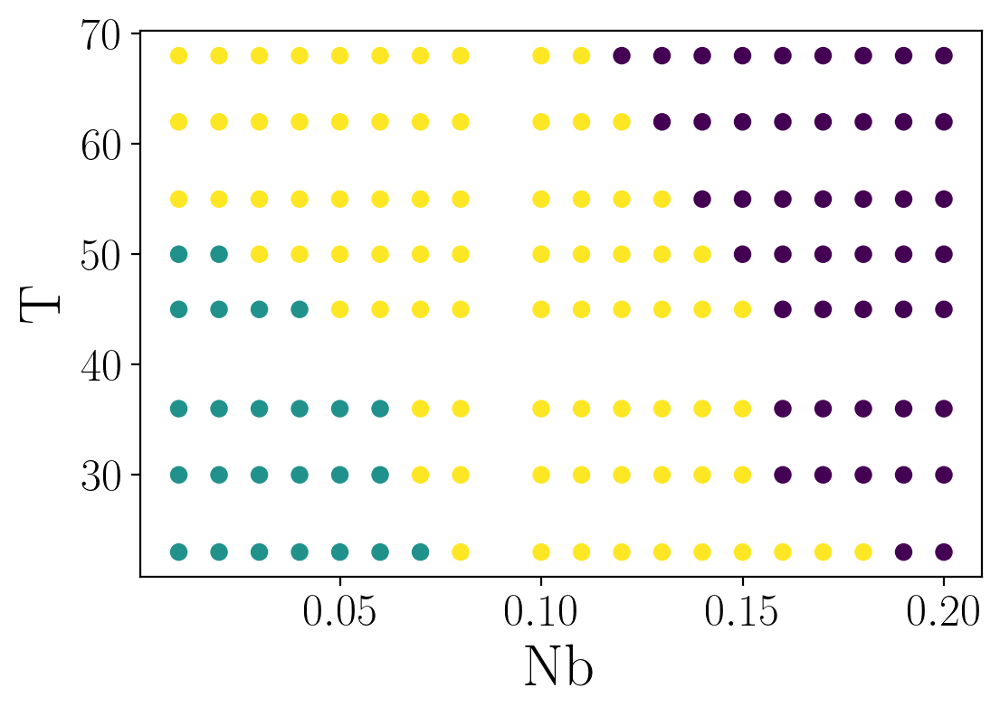

# VNbO2 diffraction data


The annotations and non-VAE results have been curated manually.
Just load them from excel and csv files:


```python
data = pathlib.Path('data')
annotations = pd.read_excel(data / 'Human Labels.xlsx', index_col=0)
annotations['Nb'] = 1 - annotations['V']

algo_labels = pd.read_csv(data / 'Compare ML Labels.csv', index_col=0)
algo_labels['V'] *= 0.01
algo_labels['Nb'] *= 0.01
```


Room temperature $V_{x}Nb_{1-x}O_2$ diffraction data patterns as function of Nb content.
With increasing Nb content, the diffraction peak broadens and shifts to the left before sharpening up again.


```python
from VNbO2.data import io

# load the dataset:
diffraction_data, angle, df = io.load_VNb2O3(detrend=False)

plt.plot(angle, diffraction_data[0], label='VO$_2$')

display = [4, 8, 12, 16]
for count, idx in enumerate(display):
  offset = 80 + count * 30
  c = int(100*df['V'].iloc[idx])
  label = f'$V_{{{c}}}Nb_{{{100-c}}}O_{{2}}$'
  plt.plot(angle, diffraction_data[idx]+offset, label=label)

plt.xlim(26,30)
plt.ylim(0,375)
plt.ylabel("Intensity (arb. units)", fontsize=22)
plt.xlabel("2-theta (deg.)", fontsize=22)
plt.xticks(fontsize=14)
plt.yticks([])
handles, labels = plt.gca().get_legend_handles_labels()
plt.legend(handles[::-1], labels[::-1])
plt.annotate('a', xy=(0.04, 0.9), xycoords='axes fraction', fontsize=24)
plt.show()
```

\


$VO_2$ diffraction data with increasing temperature.
In this case two distinct diffraction peaks are clearly identifiable.


```python

display = [44, 132, 220, 308]
offsets = [0, 60, 80, 60]
for offset, idx in zip(np.cumsum(offsets), display):
  t = df['temp'].iloc[idx]
  label = f'{t+273} K'
  plt.plot(angle, diffraction_data[idx]+offset, label=label)

plt.xlim(26,30)
plt.ylim(0,375)
plt.ylabel("Intensity (arb. units)", fontsize=22)
plt.xlabel("2-theta (deg.)", fontsize=22)
plt.xticks(fontsize=14)
plt.yticks([])
handles, labels = plt.gca().get_legend_handles_labels()
plt.legend(handles[::-1], labels[::-1])
plt.show()
```

\


## expert phase assignment
Let's compare the human expert annotations.
Each expert assigns each diffraction pattern a label corresponding to the monoclinic phase (0),
both phases (1), or the tetragonal phase (2).
Here we plot the per-point Shannon entropy of the label distribution.
Shannon entropy of 0 indicates unanimity among the experts.
Increasing entropy values indicate higher levels of disagreement between experts.


\


Now let's visualize the consensus between expert annotators.


```python
from VNbO2 import gp

# merge all labels into a single table
all_labels = []
for labeler in labelers:
    _df = annotations.loc[:,('Nb', 'temp', labeler)]
    _df = _df.rename(columns={labeler: 'label'})
    _df['labeler'] = labeler
    all_labels.append(_df)

all_labels = pd.concat(all_labels)

# fit a GP classifier to model the human expert consensus...
X = all_labels.loc[:,('Nb', 'temp')].values
y = all_labels['label'].values
m = gp.fit_sparse_gp(X, y[:,None], n_classes=3)

# visualize the consensus model
c, extent = gp.snapshot(df, m);

# plot the label entropy over top of the GP consensus...
plt.scatter(annotations['Nb'], annotations['temp'], c=se, cmap='Blues', edgecolors='k')
plt.show()
```

\


We can use this consensus model to rank cluster assignments relative to the human annotators.


```python
from VNbO2.utils import order_labels

# algo_key = 'Brian_spectral_clustering'
algo_key = 'NREL_kmeans_cluster'
X = algo_labels.loc[:,('Nb', 'temp')].values.astype(np.float64)
Y = order_labels(algo_labels[algo_key], algo_labels['Nb'])

E, error_indicator = gp.variational_log_likelihoods(X, Y, m)
E = E.numpy()
np.sum(E)
plt.scatter(
    algo_labels['Nb'], algo_labels['temp'], c=np.exp(E),
    cmap='Blues', edgecolors='k', vmin=0, vmax=1
)
# plt.scatter(annotations['Nb'], annotations['temp'], c=error_indicator*np.exp(E), cmap='RdBu', edgecolors='k')

plt.colorbar(label='$P_{cos}$')

s = error_indicator < 0
plt.scatter(algo_labels['Nb'][s], algo_labels['temp'][s], c='none', edgecolors='r', s=80)


# np.array(Yvar).min()
plt.xlabel('Nb')
plt.ylabel('temperature (C)');
# plt.savefig('VNb-cluster-example.png')
plt.show()
```

```
---------------------------------------------------------------------------KeyError
Traceback (most recent call last)/usr/local/lib/python3.8/site-
packages/pandas/core/indexes/base.py in get_loc(self, key, method,
tolerance)
   2645             try:
-> 2646                 return self._engine.get_loc(key)
   2647             except KeyError:
pandas/_libs/index.pyx in pandas._libs.index.IndexEngine.get_loc()
pandas/_libs/index.pyx in pandas._libs.index.IndexEngine.get_loc()
pandas/_libs/hashtable_class_helper.pxi in
pandas._libs.hashtable.PyObjectHashTable.get_item()
pandas/_libs/hashtable_class_helper.pxi in
pandas._libs.hashtable.PyObjectHashTable.get_item()
KeyError: 'NREL_kmeans_cluster'
During handling of the above exception, another exception occurred:
KeyError                                  Traceback (most recent call
last)<ipython-input-1-ea0608876a1c> in <module>
      4 algo_key = 'NREL_kmeans_cluster'
      5 X = algo_labels.loc[:,('Nb',
'temp')].values.astype(np.float64)
----> 6 Y = order_labels(algo_labels[algo_key], algo_labels['Nb'])
      7
      8 E, error_indicator = gp.variational_log_likelihoods(X, Y, m)
/usr/local/lib/python3.8/site-packages/pandas/core/frame.py in
__getitem__(self, key)
   2798             if self.columns.nlevels > 1:
   2799                 return self._getitem_multilevel(key)
-> 2800             indexer = self.columns.get_loc(key)
   2801             if is_integer(indexer):
   2802                 indexer = [indexer]
/usr/local/lib/python3.8/site-packages/pandas/core/indexes/base.py in
get_loc(self, key, method, tolerance)
   2646                 return self._engine.get_loc(key)
   2647             except KeyError:
-> 2648                 return
self._engine.get_loc(self._maybe_cast_indexer(key))
   2649         indexer = self.get_indexer([key], method=method,
tolerance=tolerance)
   2650         if indexer.ndim > 1 or indexer.size > 1:
pandas/_libs/index.pyx in pandas._libs.index.IndexEngine.get_loc()
pandas/_libs/index.pyx in pandas._libs.index.IndexEngine.get_loc()
pandas/_libs/hashtable_class_helper.pxi in
pandas._libs.hashtable.PyObjectHashTable.get_item()
pandas/_libs/hashtable_class_helper.pxi in
pandas._libs.hashtable.PyObjectHashTable.get_item()
KeyError: 'NREL_kmeans_cluster'
```


Compute log likelihoods for each cluster assigment:


```python
algo_keys = algo_labels.columns[3:]
X = algo_labels.loc[:,('Nb', 'temp')].values.astype(np.float64)
loglik = algo_labels.iloc[:,:3].copy()

for algo_key in algo_keys:
    Y = order_labels(algo_labels[algo_key], algo_labels['Nb'])
    E, error_indicator = gp.variational_log_likelihoods(X, Y, m)
    loglik[algo_key] = E.numpy()

    print(algo_key, np.sum(np.exp(E)) / Y.size)

loglik.to_csv('data/cluster_assignment_loglik.csv')
```

```
Comp-Distance-Spectral 0.3945914289890901
Cosine-Local-Scaling-Spectral 0.42508839785216124
Cosine-Spectral 0.47636921080777056
VAE-Spectral 0.6050567361343479
```


## Evaluate the VAE results


```python
df_vae = pd.read_csv('data/vae/Summary/summary_2d_threeGMM.txt', delim_whitespace=True)
df_vae['Nb'] = 1 - 0.01*df_vae['C']
X = df_vae.loc[:,('Nb', 'T')]
Y = order_labels(df_vae['G'], X['Nb'])
plt.scatter(X['Nb'], X['T'], c=Y)
plt.show()
```

\


```python
_df
vae_loglik = df_vae.loc[:,('Nb', 'T')].copy()
vae_loglik = vae_loglik.loc[vae_loglik['Nb'] <= 0.2]

vae_path = pathlib.Path('data/vae/Summary')

for run in vae_path.glob('*three*.txt'):
    prefix, _ = os.path.splitext(run.parts[-1])
    algo_key = prefix.replace('summary_', '')

    run_df = pd.read_csv(run, delim_whitespace=True)
    run_df['Nb'] = 1 - 0.01*run_df['C']

    run_df = run_df.loc[run_df['Nb'] <= 0.2]

    X = run_df.loc[:,('Nb', 'T')]
    Y = order_labels(run_df['G'], X['Nb'])

    E, error_indicator = gp.variational_log_likelihoods(X.values, Y, m)
    vae_loglik[algo_key] = E.numpy()

    print(algo_key, np.sum(np.exp(E)) / Y.size)

vae_loglik.to_csv('data/cluster_assignment_loglik_vae.csv')
```

```
2d_threed_spectral 0.5463001165431945
2d_three_spectral 0.6050567361343507
2d_threeGMM 0.5449173567470824
2d_threek_means 0.6105299854818891
```


## Compare log relative likelihood for all models

```python
loglik = pd.read_csv('data/cluster_assignment_loglik.csv', index_col=0)
loglik = loglik.sort_values(by=['Nb', 'temp']).reset_index()
vae_loglik = pd.read_csv('data/cluster_assignment_loglik_vae.csv', index_col=0)
vae_loglik = vae_loglik.sort_values(by=['Nb', 'T']).reset_index()

loglik = pd.concat((loglik, vae_loglik.iloc[:,3:]), axis=1)
ll = loglik.sum()[4:]

# assumes each model has the same number of parameters...
aic_ = -2 * ll
idx_best = np.argmin(aic_)
log_rel_lik = (aic_[idx_best] - aic_) / 2
log_rel_lik = log_rel_lik.sort_values(ascending=False)

fig, ax = plt.subplots()

xticks = list(map(lambda s: s.replace('_', '-'), log_rel_lik.index))
log_rel_lik.plot(marker='o')
ax.set_xticks(range(log_rel_lik.size))
ax.set_xticklabels(xticks, rotation=45, ha='right', fontsize=10)
ax.set(ylabel='log relative likelihood')
plt.savefig('figures/cluster_log_relative_likelihoods.png', bbox_inches='tight')
plt.show()
```

\


## Run a case study on composition threshold


```python
from VNbO2 import cluster
from VNbO2.data import io
ar = (27, 28.5)
diffraction_data, angle, df = io.load_VNb2O3(detrend=True, angular_range=ar)
sel = df.Nb <= 0.2
km = cluster.self_tuning_spectral_clustering(diffraction_data[sel], metric='cosine')
plt.scatter(df['Nb'][sel], df['temp'][sel], c=km.labels_)
plt.xlabel('Nb')
plt.ylabel('T')
plt.show()
```

\


```python
fig, axes = plt.subplots(ncols=4, figsize=(16,2.5), sharey=True)
diffraction_data, angle, df = io.load_VNb2O3(detrend=True, angular_range=ar)

for idx, (ax, threshold) in enumerate(zip(axes, [0.18, 0.2, 0.22, 0.24, 0.26])):
    sel = df.Nb <= threshold
    km = cluster.self_tuning_spectral_clustering(diffraction_data[sel], metric='cosine')
    L = order_labels(km.labels_, df['Nb'][sel])
    ax.scatter(df['Nb'][sel], df['temp'][sel], c=L)
    title = '$Nb_{max}$ = ' + f'{threshold}'
    ax.set(xlim=(0,0.205), xlabel='Nb', title=title)
    ax.annotate('abcd'[idx], xy=(0.02,1.05), xycoords='axes fraction')

axes[0].set(ylabel='T ($^\circ$ C)')
plt.savefig('figures/spectral_composition_study.png', bbox_inches='tight')
plt.show()
```

\


```python
thresholds = np.arange(0.2, 0.31, 0.01)
logliks = []

for threshold in thresholds:
    sel = df.Nb <= threshold
    Nb = df['Nb'][sel].values
    X = df.loc[sel,('Nb', 'temp')].values.astype(np.float64)

    km = cluster.self_tuning_spectral_clustering(diffraction_data[sel], metric='cosine')
    L = order_labels(km.labels_, Nb)

    eval_at = Nb <= 0.2
    E, error_indicator = gp.variational_log_likelihoods(X[eval_at], L[eval_at,None], m)
    logliks.append(E.numpy())

plt.plot(thresholds, [ll.sum() for ll in logliks])
```

```
[<matplotlib.lines.Line2D at 0x14b841040>]
```

\


```python
def evaluate_patched_clustering(L, df, Nb_cutoff=0.2):
    eval_at = df['Nb'] <= Nb_cutoff
    df_eval = df.loc[:,('Nb', 'temp')].copy()
    X_clust = df.loc[sel, ('Nb', 'temp')]

    # default to high temperature cluster to extend those predictions...
    df_eval['label'] = 2
    df_eval.loc[X_clust.index, 'label'] = L
    df_eval = df_eval.loc[eval_at]

    X_eval = df_eval.loc[:,('Nb', 'temp')]
    df_eval['label'].values[:,None]
    E, error_indicator = gp.variational_log_likelihoods(X_eval.values, df_eval['label'].values[:,None], m)
    return E.numpy()

# patch in labels for clustering results with threshold less than 0.2
thresholds = np.arange(0.10, 0.31, 0.01)
logliks = []
for threshold in thresholds:
    sel = df.Nb <= threshold
    Nb = df['Nb'][sel].values

    km = cluster.self_tuning_spectral_clustering(diffraction_data[sel], metric='cosine')
    L = order_labels(km.labels_, Nb)

    logliks.append(evaluate_patched_clustering(L, df))

N = logliks[0].size
aic_ = -2 * np.array([ll.sum() for ll in logliks])
idx_best = np.argmin(aic_)
# idx_20 = np.argmax(thresholds > 0.195)
# rel_lik = np.exp((aic_[idx_best] - aic_) / (2*N))
log_rel_lik = (aic_[idx_best] - aic_) / 2
plt.plot(thresholds, log_rel_lik, marker='o')
plt.xlabel('$Nb_{max}$ threshold')
plt.ylabel('log relative likelihood')
plt.axvline(0.19, linestyle='--', alpha=0.5)
plt.axhline(0.0, linestyle='--', color='k')
plt.xlim(0.1, 0.3)
plt.savefig('figures/spectral_composition_study_rel_lik.png', bbox_inches='tight')
plt.show()
```

\

